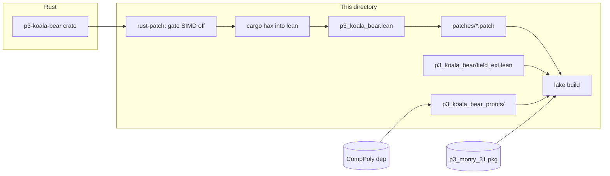

# Koala Bear — Lean extraction

**What this is:** Hax-extracted Lean from the `p3-koala-bear` Rust crate, plus
proofs checked against [CompPoly](https://github.com/Verified-zkEVM/CompPoly)’s Koala
Bear field spec. KoalaBear *is* `MontyField31<KoalaBearParameters>`, so this
extraction now **depends on the extracted [monty-31](../../../../monty-31/proofs/lean/extraction/)
Lean** (Lake path `require`) — the same pattern as keccak/blake3 depending on
`p3_symmetric`, and as baby-bear — instead of re-stubbing monty-31 and the lower
field deps.



| You’re looking for… | Go to |
|---------------------|--------|
| **Regenerate** extraction + apply patch + build | `proofs/lean/extraction/build-proofs.sh` |
| **Why** the patch exists, how to refresh it | [`patches/README.md`](patches/README.md) |
| **What** is trusted vs proved | [`TCB.md`](TCB.md) |
| **Syncing** upstream Plonky3 / fixing drift | [`SYNC.md`](SYNC.md) |

## The monty-31 dependency + SIMD patch

- `lakefile.toml` requires **Hax** + **CompPoly** + **p3_monty_31** (Lake path
  `../../../../monty-31/proofs/lean/extraction`). `lake-manifest.json` pins **Hax to
  `c1a93f0f…`** — the rev all field crates / the shared `.lake/packages` use; do not
  float it to `main` (rebuilds a divergent Hax and breaks the monty-31 dependency).
- `build-proofs.sh` applies a **Rust source patch** (`../rust-patch/`) that gates
  koala-bear's SIMD modules off under `--cfg hax`, **plus monty-31's source patch**
  (the dependency must be SIMD-gated too — `cargo hax` only sets `--cfg hax` on the
  primary crate). The extraction is the portable path; no NEON references remain.
- The former local stubs (`p3_monty_31`, `p3_field`, `p3_mds`, `p3_poseidon{1,2}`,
  `p3_symmetric`, `p3_challenger`) are **deleted** — they now come from the monty-31
  package. Only koala-specific supplements remain in `p3_koala_bear/field_ext.lean`
  (the per-field `exp_…` constant; a blanket array→slice `AsRef`).

## Layout

| Path | Role |
|------|------|
| `p3_koala_bear.lean` | Hax output (SIMD-free) + [`patches/p3_koala_bear.patch`](patches/p3_koala_bear.patch). |
| `p3_koala_bear/dependencies.lean` | imports `p3_monty_31` + `field_ext`. |
| `p3_koala_bear/field_ext.lean` | koala-specific supplementary stubs. |
| `p3_koala_bear_proofs/` + `.lean` | theorems bridging extraction constants ↔ CompPoly (`constants.lean`). |
| `lakefile.toml` | libs `p3_koala_bear`, `p3_koala_bear_proofs`; requires **Hax** + **CompPoly** + **p3_monty_31** (path). |
| `build-proofs.sh`, `patches/` | regeneration (dual source patch) + Lean patch + `update-patch.sh`. |
| `../rust-patch/` | koala-bear SIMD source patch + README. |

## Quick check (no regeneration)

```bash
cd proofs/lean/extraction && lake build
```

Pin: `lean-toolchain`. `.lake/` is gitignored; this directory's `.lake/packages` is
the **shared** package build other crates symlink to.
