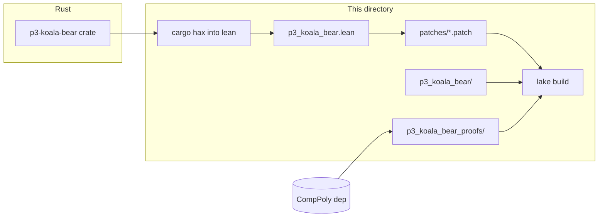

# Koala Bear — Lean extraction

**What this is:** Hax-extracted Lean from the `p3-koala-bear` Rust crate, plus stubs and proofs checked against [CompPoly](https://github.com/Verified-zkEVM/CompPoly)’s Koala Bear field spec.



| You’re looking for… | Go to |
|---------------------|--------|
| **Regenerate** extraction + apply patch + build | From crate root: `proofs/lean/extraction/build-proofs.sh` (see script header) |
| **Why** the patch exists, how to refresh it | [`patches/README.md`](patches/README.md) |
| **What** is trusted vs proved | [`TCB.md`](TCB.md) |
| **Syncing** upstream Plonky3 / fixing drift | [`SKILL.md`](SKILL.md) |

## Layout

| Path | Role |
|------|------|
| `p3_koala_bear.lean` | **Only** file overwritten by Hax; then [`patches/p3_koala_bear.patch`](patches/p3_koala_bear.patch) is applied |
| `p3_koala_bear/` | Hand-written stubs for crates not extracted here (`dependencies.lean` imports them) |
| `p3_koala_bear_proofs/` | Theorems bridging extraction constants ↔ CompPoly (`constants.lean`, …) |
| `p3_koala_bear_proofs.lean` | Root module for the proofs library |
| `lakefile.toml` | Lake package: libraries `p3_koala_bear`, `p3_koala_bear_proofs`; requires **Hax** + **CompPoly** |

## Quick check (no regeneration)

```bash
cd proofs/lean/extraction && lake build
```

Pin: `lean-toolchain`. Dependencies resolve via Lake into `.lake/` (gitignored).
